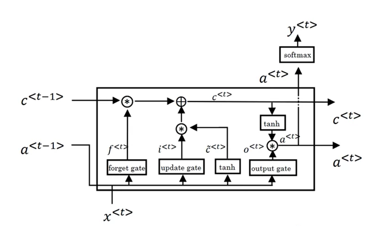

# tensorflow.python.keras.layers

## base_layer

层基类

### 构造参数

- activation

   输出值，可以是一个字符串如"relu"，也可以是一个函数对象如tf.keras.activations.relu

### 方法

- set_weights


## Input


## Activation

## Dot

```python
Dot(axes)([])
```

## 卷积神经网络

### 卷积层

- Conv2D

### 池化层

- MaxPooling2D

### 反卷积层

- Conv2DTranspose

## 优化层

- DropOut

## 变形层

### Reshape

## 复杂结构

### concatenate

实现残差结构，跳跃连接

```python
Concatenate(axis)
```

## 序列模型

### Embedding

- 输入

  输入为一个整数型矩阵(batch size,max input length),

  该输入对应位转换为索引的句子，因此最大的整数不会超过词库大小

- 输出

  大小为(batch size,max input length,dimension of word vectors)


```python
 def __init__(self,
               input_dim,# 单词个数
               output_dim,# 编码维度
               embeddings_initializer='uniform',
               embeddings_regularizer=None,
               activity_regularizer=None,
               embeddings_constraint=None,
               mask_zero=False,
               input_length=None,
               **kwargs):
```

### LSTM



$$
c^{<t>}=a^{<t>}\\
\Gamma_u=\sigma (W_u[a^{<t-1>},x^{<t>}]+b_u) \\
\Gamma_f=\sigma(W_f[a^{<t-1>},x^{<t>}]+b_r) \\
\Gamma_o=\sigma(W_o[a^{<t-1>},x^{<t>}]+b_o)\\
\tilde c^{<t>}=tanh(W_c[c^{<t-1>},x^{<t>}]+b_c)\\
c^{<t>}=\Gamma_u*\tilde c^{<t>}+\Gamma_f*c^{<t-1>} \\
a^{<t>}=\Gamma_o tanh(c^{<t>})
$$
构造参数：

```python
tf.keras.layers.LSTM(
    units,
    activation="tanh",
    recurrent_activation="sigmoid",
    use_bias=True,
    kernel_initializer="glorot_uniform",
    recurrent_initializer="orthogonal",
    bias_initializer="zeros",
    unit_forget_bias=True,
    kernel_regularizer=None,
    recurrent_regularizer=None,
    bias_regularizer=None,
    activity_regularizer=None,
    kernel_constraint=None,
    recurrent_constraint=None,
    bias_constraint=None,
    dropout=0.0,
    recurrent_dropout=0.0,
    return_sequences=False,
    return_state=False,
    go_backwards=False,
    stateful=False,
    time_major=False,
    unroll=False,
    **kwargs
)
```

调用参数：

- inputs

- mask

- training

- inisital_state

  接受一个列表,[s,c]

### RepatVector

复制多份

## Bidirectional

构建双向循环网络

```python
tf.keras.layers.Bidirectional(
    layer, merge_mode="concat", weights=None, backward_layer=None, **kwargs
)
```

- merge_mode

  sum,concat,ave,arg

- backward_layer

  keras.layers.RNN

  keras.layers.Layer

