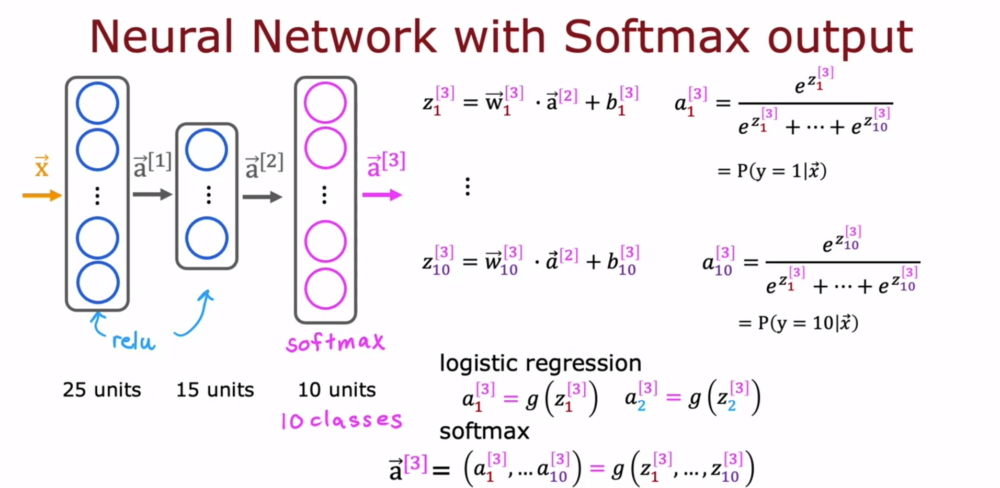
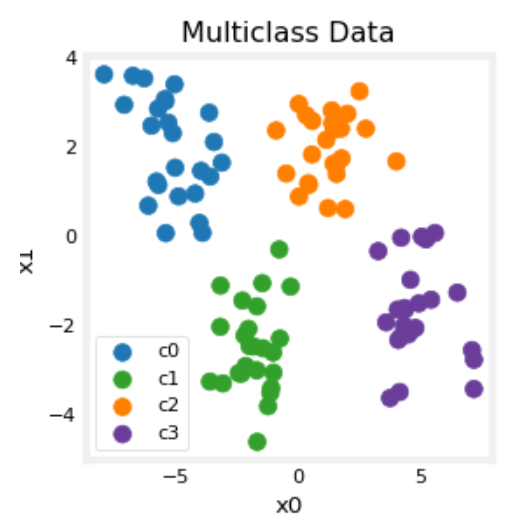
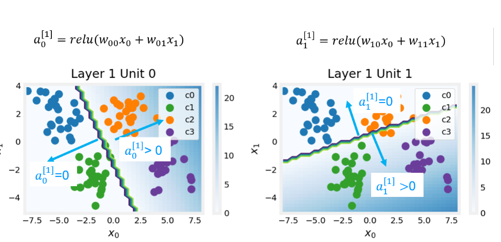
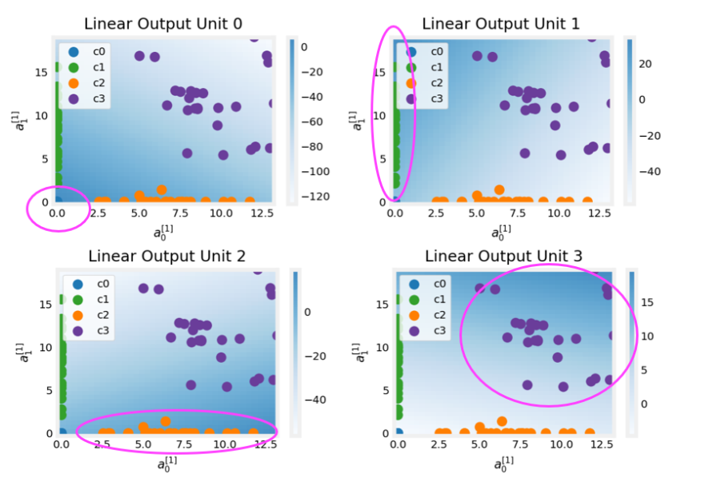

## 多类分类(softmax回归模型)

使用神经网络以及softmax解决多分类问题。

神经网络用有一个softmax输出层



### 模型

$$
z=wx+b \hfill \\
f(x)=\frac{e^z}{\sum_{i=1}^N e^{z_i}} \hfill \\
$$

### 损失函数

SpareCategoricalCrossentropy

稀疏交差熵损失函数，稀疏即指只会是其中状态的一种
$$
\vec a=softmax(\vec  z)\\
L(\vec a,y)=
\begin{cases}
-log(a_1) \ \ \  y=1 \\
... \\
-log(a_n)\ \ \  y=n
\end{cases} \\
J(w,b)=\frac{1}{m}\sum_{i=1}^m\sum_{j=1}^N \{y^{(i)}=j\}(-log\frac{e^{z_j^{(i)}}}{\sum_{k=1}^Ne^{z_k^{(i)}}})
$$

### 代码

```python
model = Sequential(
    [ 
        Dense(25, activation = 'relu'),
        Dense(15, activation = 'relu'),
        Dense(4, activation = 'softmax')    # < softmax activation here
    ]
)
model.compile(
    loss=tf.keras.losses.SparseCategoricalCrossentropy(),
    optimizer=tf.keras.optimizers.Adam(0.001),
)

model.fit(
    X_train,y_train,
    epochs=10
)
        
```

更好的实现方式：softmax涉及除法可能存在精度损失。

以上的实现是z映射到了softmax后，再计算loss，等于强制计算了中间项，以下的实现方式在loss中才映射到softmax，tensorflow会优化计算顺序，并不一定计算原先的中间项，来达到更精确的计算。

```python
preferred_model = Sequential(
    [ 
        Dense(25, activation = 'relu'，kernel_regularizer=tf.keras.regularizers.l2(0.1)),
        Dense(15, activation = 'relu'，kernel_regularizer=tf.keras.regularizers.l2(0.1)),
        Dense(4, activation = 'linear')   #<-- Note
    ]
)
preferred_model.compile(
    loss=tf.keras.losses.SparseCategoricalCrossentropy(from_logits=True),  #<-- Note
    optimizer=tf.keras.optimizers.Adam(0.001),
)

preferred_model.fit(
    X_train,y_train,
    epochs=10
)
        
```

### 示例与感知

假设有四个类别待分

```python
# make 4-class dataset for classification
classes = 4
m = 100
centers = [[-5, 2], [-2, -2], [1, 2], [5, -2]]
std = 1.0
X_train, y_train = make_blobs(n_samples=m, centers=centers, cluster_std=std,random_state=30)
```



模型与训练如下

```python
tf.random.set_seed(1234)  # applied to achieve consistent results
model = Sequential(
    [
        Dense(2, activation = 'relu',   name = "L1"),
        Dense(4, activation = 'linear', name = "L2")
    ]
)
model.compile(
    loss=tf.keras.losses.SparseCategoricalCrossentropy(from_logits=True),
    optimizer=tf.keras.optimizers.Adam(0.01),
)

model.fit(
    X_train,y_train,
    epochs=200
)
```

分类结果如下


第一次层训练出了两个函数，并将图像两次分成了两个部分



第一层创建了新的特征供第二层评估，背景颜色强度的大小代表了该单元激活函数的值。



## 数学

$$
dz=\hat y-y
$$


## 多标签分类问题(multi-label classification)

可以使最后的输出层，每个神经元代表一个标签是否为真的概率，采用sigmoid的激活函数。