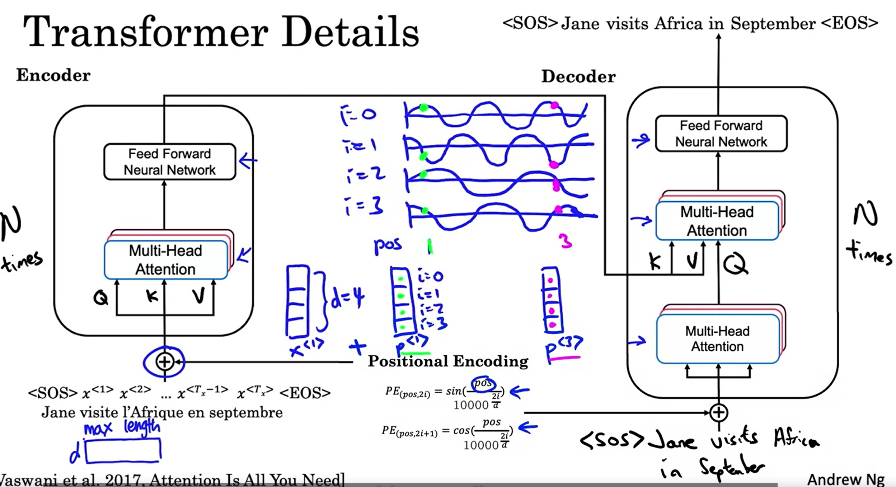
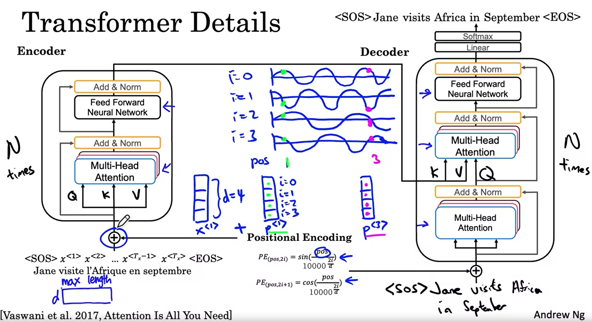

# Transformers Network

## Self-Attention Intuition

每个单词计算$A(q,K,V)$基于注意力的向量（attention-based vector representation of a word）

得到$A^{<1>},...,A^{<t>}$
$$
A(q,K,V)=\sum_i\frac{exp(q\cdot k^{<i>})}{\sum_j exp(q\cdot k^{<j>})}v^{<i>} \\
q^{<i>}=W^Q\cdot x^{<i>}\\
k^{<i>}=W^K\cdot x^{<i>}\\
v^{<i>}=W^V\cdot x^{<i>}\\
$$
其中$q^{<i>}$代表query，如单词i发生了什么，$q^{<i>}\cdot k^{<j>}$通过相似性代表了单词j能回答该问题的置信度，$v^{<i>}$代表该问题的答案，问题的属性

有另一种写法,并称之为scaled dot-product attention
$$
Attention(Q,K,V)=softmax(\frac{QK^T}{\sqrt{d_k}})V
$$
## Multi-Head Attention

有多个类似Self-Attention的结构，并新增一层参数层变换q，k，v，最终将多个attention串行在一起

## Transformer

### 位置信息编码

## Add Norm

## Masked Multi-Head Attention

在测试训练时期，屏蔽Decoder输入的后面一部分，看神经网络是否能够准确预测序列中的下一个单词

## 位置编码

$$
\theta(pos,i,d)=\frac{pos}{10000^{\frac{2i}{d}}}
$$

- d为单词编码以及位置编码的维度
- pos为单词的位置
- k=range(0,d),i=k//2

## Mask

### Padding Mask

transformer有最大可处理序列长度，超出最大长度将被截断，不满最大长度将被补0，然而这些0会影响softmax的计算，根据softmax，我们希望补充的部分概率为0，x为极小值

### Look-ahead Mask

假装预测一部分输出，并观察是否会预测下一段输出

## 并行化实现

