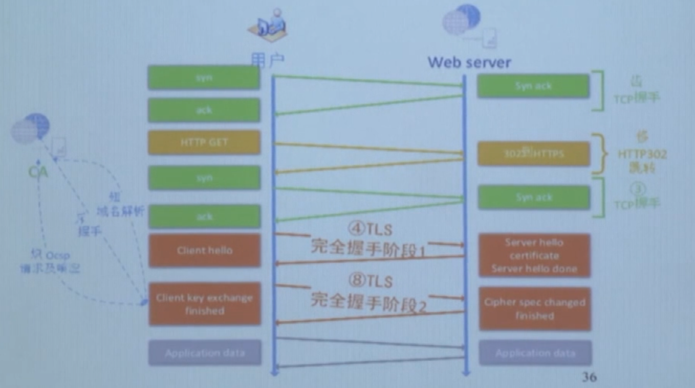
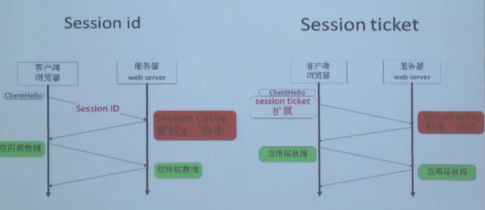

# HTTP

请求-响应协议。超文本传输协议。

使用TCP作为支撑传输层的协议。

默认工作在TCP协议的80端口。

## HTTP头部信息

- 通用头部

- 请求头部

  告诉服务器的信息，自己允许哪些媒体类型。

- 响应头部

  告知客户端的服务器信息等

- 实体头部

### HTTP请求报文

请求方法     URL   HTTP-Version 

​                请求头

​                 请求正文

- 请求行

  - 方法字段

    - GET

    - POST

    - HEAD

      当服务器收到HEAD方法的请求时，将会用一个HTTP报文进行相应，但是并不返回请求对象

    - PUT

      允许用户上传对象到指定web服务器

    - DELETE

      允许用户删除web服务器上的对象

  - URL字段
  - HTTP版本字段

- 首部行

- 实体

  当使用POST报文方法时使用

### HTTP响应报文

- 初始状态行

  - 版本

  - 状态码

    - 200 OK

      请求成功，信息在返回的响应报文中

    - 301 Moved Permanently

      请求的对象已经被永久转移了，新的URL定义在响应报文的Location：首部行中，客户软件将自动获取新的URL

    - 400 Bad Request：

      一个通用的差错代码，请求不能被服务器理解

    - 404 Not Found

      被请求的文档不在服务器上

    - 505 HTTP Version Not Supported

      服务器不支持请求报文使用的HTTP协议版本

- 请求头（首部行）

  - Connection：close

    发送完报文就关闭TCP连接

  - Date：

    服务器产生并发送该响应报文的时间

  - Server：

    表示服务器类型，如Apache/2.2.3

  - Last-Modified:

    对象创建或者最后修改的日期和时间

  - Content-Length:

    被发送对象的字节数

  - Content-Type：

    被发送对象的类型，如text/html

- 请求正文

  只有在post时有

## Keep-Alive

是否每次完成请求处理后立即断开TCP链接

HTTP/1.0 非Keep-Alive

HTTP/1.1 默认Keep-Alive

## 状态保持

- Session

  保存在服务端

- Cookie

  保存在客户端

## get和post

### 区别

- get请求的数据会放在url之后，请求的参数会被完整的保留在浏览器记录中。

  post参数放在请求主题中，参数不会被保留，相对更加安全。

- get请求只支持url编码，post请求支持多种编码格式。

- get只支持ASCII字符格式的参数，而post没有区别。

- get提交的数据大小有限制（浏览器的url限制），而post的数据没限制

- get方法产生一个TCP数据包，post方法产生两个

## 状态码

200 请求成功
204 请求成功但无内容返回
206 范围请求成功

301 永久重定向； 30(2|3|7)临时重定向，语义和实现有略微区别；
304 带if-modified-since 请求首部的条件请求，条件没有满足

400 语法错误
401 需要认证信息
403 拒绝访问
404 找不到资源
412 除if-modified-since 以外的条件请求，条件未满足

500 服务器错误
503 服务器宕机了

## cookie

- 在HTTP响应报文中的一个cookie首部行
- 在HTTP请求报文中的一个cookie首部行
- 在用户端系统中保留一个cookie文件，并由用户的浏览器进行管理
- 位于Web站点的一个后端数据库

### 流程

- 普通请求
- 响应报文 Set-cookie：cookie_id
- 浏览器在管理的特定cookie文件中添加一行，包含服务器的主机名和cookie_id
- 之后的每次请求报文增加首部行 Cookie:cookid_id

## Web缓存

Web缓存器也叫代理服务器，它时能够代表Web服务器来满足HTTP请求网络实体。

Web缓存器有自己的磁盘存储空间，并在存储空间中保存最近请求过的对象的副本。

当采用Web缓存时，访问网站流程如下

- 浏览器创建一个到Web缓存器的TCP连接，并向Web缓存器中的对象发送一个HTTP请求
- Web缓存器进行检查，看看本地是否存储了该对象的副本
  - 若由直接发送具有该对象的HTTP响应
  - 若没有，Web缓存服务器打开一个与拥有该对象的原服务器的TCP连接，获取并存储，并响应客户机

#### 条件GET方法

检验缓存是否为最新

If-Modified-since：[Last-Modified]

## 

# HTTP发展历程

## HTTP/1.1和HTTP/1.0的区别

- 缓存处理

  1.1有更多关于缓存的字段

- 节约带宽

  1.1允许只请求部分资源，range头域控制

- 错误的通知管理

  1.1新增了24个错误状态码

- Host请求头

  新增了host请求头，辨识虚拟主机（同一个ip不同主机）

- keep-Alive

  1.1默认Keep-Alive

## HTTP/1.x和HTTP/2.0的区别

- 1.x的文本采用字符串传送。2.0采用二进制传输，封装成帧，帧组成了数据流
- 2.0支持多路复用，通过一个请求实现多个HTTP请求传输
- 2.0有信息压缩
- 2.0支持在客户端未经请求许可的情况下进行服务器推送

## QUIC（quick UDP Internet Connect）

HTTP/3的前身。

主要提升有：

- 采用UDP，更快。

- 具有加密机制。

- 运行在用户域，而不是系统内核

- 具有纠错机制

  包含了本身以外其他数据包的内容

- 更加准确的多路复用，避免了tcp的队头阻塞 

## HTTP/3

主要特点：

- 采用udp通信
- QUIC保证安全性，建立连接就完成了TLS加密握手
- 头部数据压缩

# HTTPS

在HTTP的基础上通过传输加密和身份认证的方式保证了数据的安全性。

~~SSL同TLS~~

工作流程如下：

- 客户端发起一个HTTPS请求，并连接到服务器的443端口，发送信息主要包括自身所支持的算法列表和密钥长度等。
- 服务端将自身所支持的所有加密算法与客户端的算法列表对比并选择一种支持的加密算法，然后将它和其他密钥组件一同发送给客户端
- 服务端向客户端发送一个包含数字证书的报文，该数字证书中包含证书的颁发机构，过期事件，服务端的公钥等信息
- 最后服务端发送一个完成报文通知客户端SSL的第一阶段已经协商完成。
- SSL第一次协商完成后，客户端发送一个回应报文，报文中包含一个客户端生成的随机密码穿，并且该报文时经过证书中的公钥加密过的
- 紧接着这客户端会发送一个提报文提示密钥
- 客户端向服务端发送一个finish报文，包含至今为止所有报文的整体校验值，最终协商是否完成取决于服务端能否成功解密
- 客户端再发送一个同样功能的报文，验证客户端是否能正确解密。
- SSL完成，之后进行和HTTP相同的通信过程

## 功能

- 身份认证，仿冒充

  确保正确的用户能访问到正确的网站

- 数据加密，防窃听

  第三方无法直接查看原始内容

- 数据一致性，防篡改，仿抵赖

  及时发现第三方对内容的篡改

## TLS完全握手

- C->S syn
- S->C ack
- C->S 密码套件
- S->C 密码套件，证书
- C->S 密钥交换 完成
- S->C 完成

## TLS简化握手

- C->S syn
- S->C ack
- C->S 密码套件
- S->C 密码套件，证书

## TLS1.3

## 数字签名

- Hash运算->文摘
- 私钥加密签名
- 接收方用公钥解密

## 流量劫持及防御

- 按劫持路径分类
  - 客户端劫持
  - 链路劫持
  - 服务端劫持
- 按劫持内容分类
  - DNS劫持
  - 页面内容篡改
  - URL篡改

## 身份认证-客户端证书校验过程

## 内容一致性校验

- 单向哈希
  - MD5
  - SHA1，SHA2
- MAC（消息认证码）

## 加密方式

对称与非对称相结合。

首先使用SSL/TLS协议弥补非对称加密的缺点，进一步采用证书加强安全性，

之后协商对称密钥。

### 客户端为什么信任第三方证书

没有CA机构的私钥，无法得到加密后的签名。

客户端解密后会发现原文和其那名解密后不一样。

## 优化计算性能

- 减少完全握手
  - session cache
  - 全局Session ticket
  - 自定义session ticket

### 完全握手性能优化

#### RSA异步代理计算

- 算法分离

- 并行代理计算

- 异步执行

  openssl状态机

## 证书部署

- Let's Encrypt
